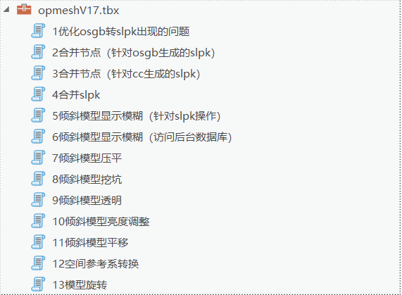

# esrichina-i3s-opmesh-tools
the tools for optimize opmesh(Oblique photographic model)

v1.7版本：修复portal显示些许问题 修复大数据量处理效率问题（很给力） 该目录下所有文件不要删除

v1.8版本：增加i3s压缩工具和对应说明文档

v2.0版本：修复合并slpk邻节点报错
祝你使用愉快！

v2.2版本：修复合并slpk工具的些许bug

v2.3版本：空间转换工具支持1.7i3s并支持多线程并发

联系邮箱：xupf@esrichina.com.cn
